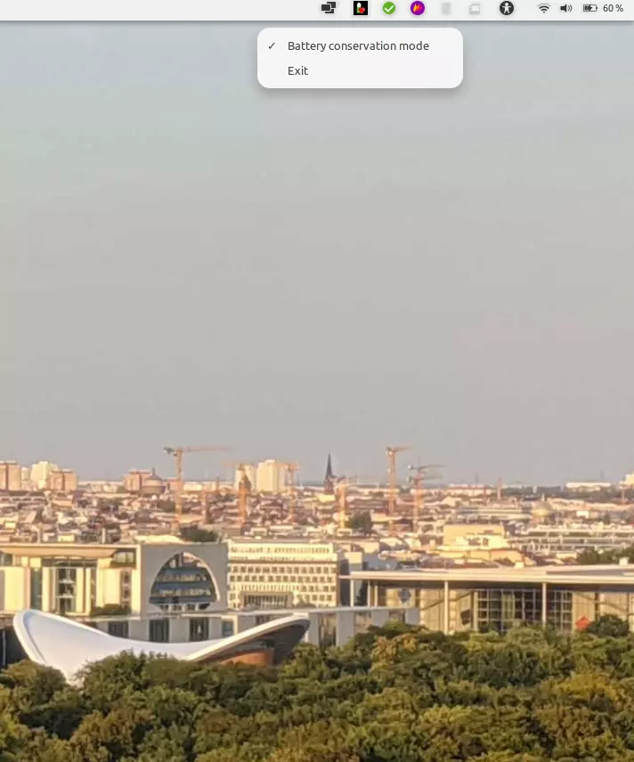

# BatteryConservationChanger
This Project aims to give you easy access to control the battery conservation mode of your Lenovo Laptop

For now the install file only works on Ubuntu.

To install the BatteryConservationChanger you have to run the install script with sudo rights.

Some Pictures:

This programm works on Lenovo laptops with battery conservation mode.
I found out about it because when using Windows there is an Lenovo Utility for it.

And on linux it can be changed by either writing a 1 or a 0 into the file located in 

`/sys/bus/platform/drivers/ideapad_acpi/VPC2004:00`

Make sure PyGObject is installed on your system because this is the library creating the tray icon.

To install just clone the project by typing 

`git clone https://github.com/freeifier/BatteryConservationChanger`

and then type

`cd BatteryConservationChanger`

at last run the installer by

`sudo bash install.sh`
